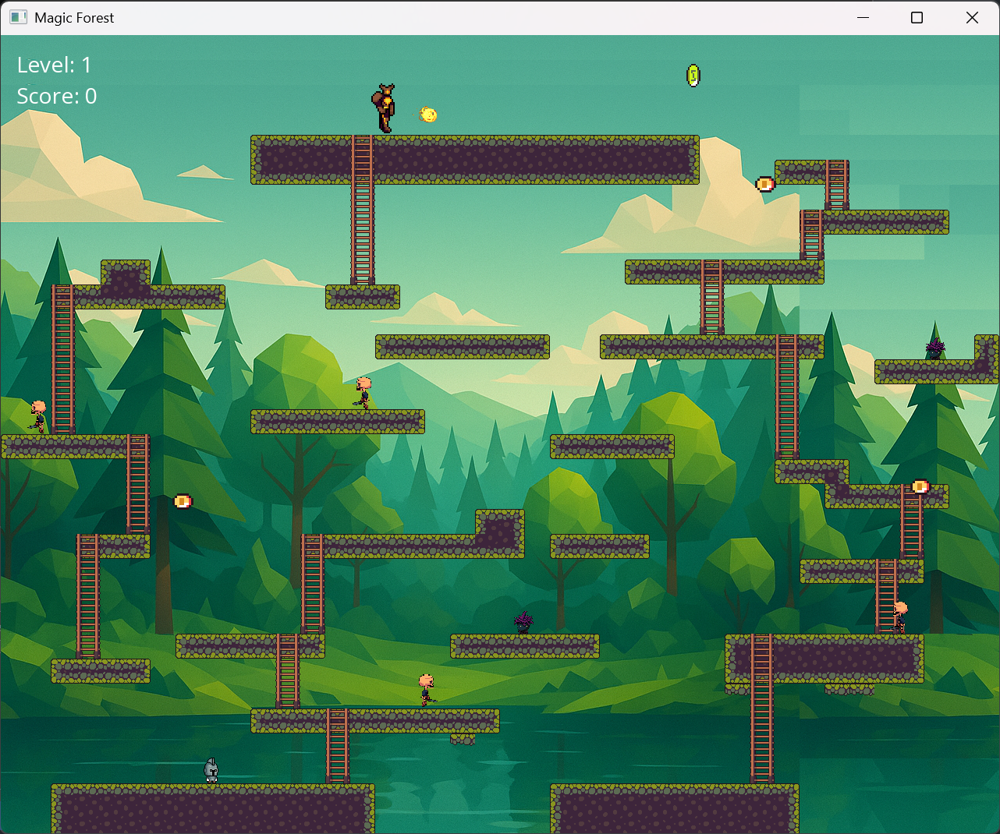

# DonkeyKongSFML

Version cmake 3.31.2
Visual Studio 2022

IMPORTANT
Download as .zip the project from GitHub, it is downloaded as DonkeyKongSFML-main, before making the build, rename the folder and remove ‘-main’, otherwise it will not load the tilests.

Launch generate.bat
Then build.bat 
build / Debug / DonkeyKongSFML.exe